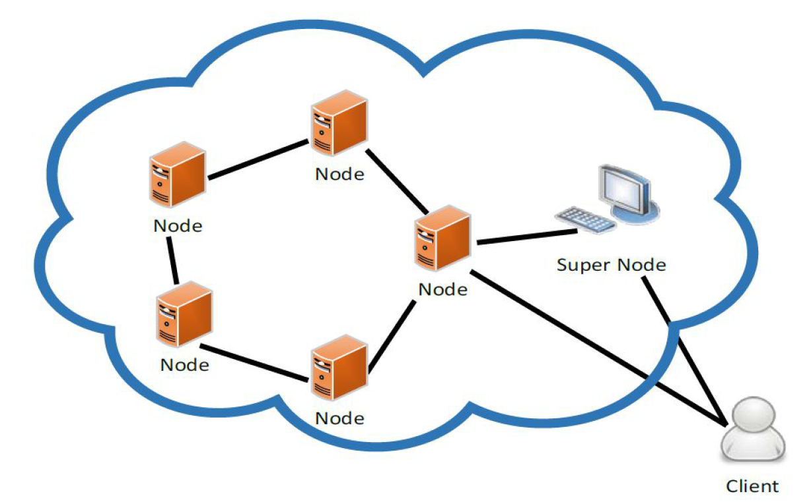

# ChorDHT
###### Distributed Hash Table based on the Chord Protocol for Book-Genre Mappings

## BRIEF

This is an implementation of a Distributed Hash Table based on the [Chord Protocol](https://pdos.csail.mit.edu/papers/chord:sigcomm01/chord_sigcomm.pdf)
using Thrift RPC and Java for storing Book-Genre Mappings. This a P2P system so each Node involved has the same powers.
For some simplicity, I have added a SuperNode which regulates Nodes joining the DHT and acts as a first contact for any
Client Node seeking to set a mapping to the DHT or to get a mapping from it.

First, the DHT would have to be configured and built with the Nodes coming online and adding themselves to
the DHT ring one by one, followed by which the Client can start using this DHT for storing and retrieving mappings.

The Client will be able to issue commands from a CLI and additionally, use a "bulk set" feature. 

For more information, look at [the problem description](pa2.pdf).

The code is well documented with very verbose logging and solid exception handling.
Future Work would be on handling Nodes joining and leaving during regular operation.

## CONFIGURATION

This [Java Properties File](gen-java/chordht.cfg) stores many of the values needed to dynamically configure the
system, including:
* addresses and port numbers of each of the node types - client, supernode and node.
* wait-before-retry times for each node type.
* number of bits for the DHT hash space.
* number of nodes.

## SAMPLE DATA

Some sample data has been provided in a [file](gen-java/shakespeares.txt).

## INSTRUCTIONS

There is a makefile provided that can be used to easily build and run the project.
*YOU NEED JAVA 1.8+ AND THRIFT 0.9+ TO RUN THIS SYSTEM*
* Check to make sure the address, ports and other options are as desired in the
sentiment.cfg file.
* Run “make clean && make” to rebuild the source.
* Run “make cli FILE=<file>” to run the client.
	* <file> should contain the path to a file which you want to bulk insert.
	* the content format should be identical to [this sample file](gen-java/shakespeares.txt).
	
* Run “make sn” to run the server.
* Run “make n NUM=<num>” to run the nodes.
	* <num> starts at 0 and should be set based on what address and port number that node runs on.
	* it's used to index into the comma separated list of addresses and port numbers provided in [the config file](gen-java/chordht.cfg).

